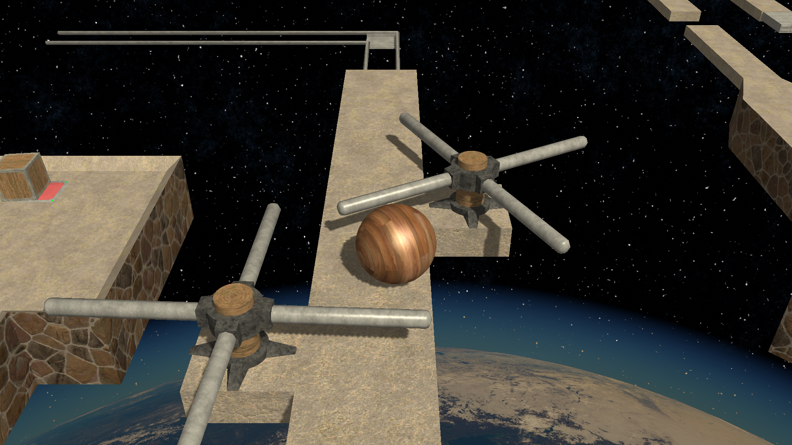

# Games:

  

## 1.RunDroid

        

## 1.Balance Ball

Balance Ball is a classic adventure game where you play as a ball trying to reach the end of the level by avoiding obstacles.

[Privacy Policy](https://m7mods3eed.github.io/Balance-Ball-Privacy-Policy/)

### Screenshots:

  

### Download: 

Not available <ja href=""><imger width="256" height="100" src="TEXTURES/PLAY_BADGE.png"></a>

# Contact us:

Contact Email: Contact.AlienEye@Gmail.com
